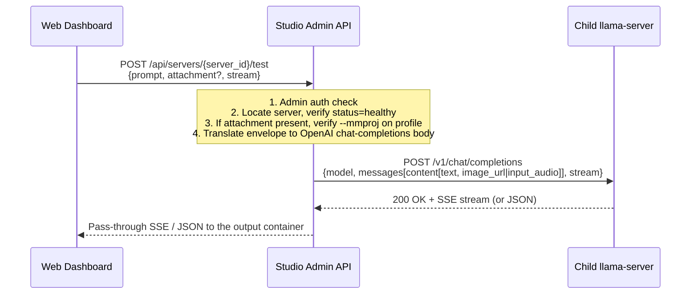

# Quick Test Feature — Design & Implementation Spec

The **Quick Test Console** is a sanity-checking interface inside the Studio UI. It lets an administrator verify that a running child `llama-server` is responding correctly to text, image, and audio inputs without having to wire up an external OpenAI client or send requests through the public Gateway.

This document is the **source of truth** for both the backend handler (`internal/httpapi/servers.go:handleTestServer`) and the frontend Send Inference panel (`web/app.js`). It supersedes the earlier draft, which described the legacy `/completion` endpoint that the studio no longer uses.

---

## 1. Quick Test vs. Gateway Server

| Feature | Quick Test Console | Gateway Server |
| :--- | :--- | :--- |
| **Purpose** | One-off sanity test against a specific child instance. | Production routing for any external OpenAI client. |
| **Studio Endpoint** | `POST /api/servers/{server_id}/test` | `POST /v1/chat/completions`, `POST /v1/completions`, … |
| **Port** | Admin port (default 3100). | Gateway port (default 3101). |
| **Authentication** | Studio admin session cookie or `Authorization: Bearer <admin-password>`. | Gateway token (`Authorization: Bearer <gateway_token>`). |
| **CORS** | Same-origin allowlist. | `Access-Control-Allow-Origin: *`. |
| **Target Routing** | Directed to one specific `llama-server` instance by `server_id`. | Dynamically routed by the `model` field in the request body. |
| **Wire format to llama-server** | OpenAI-compatible `/v1/chat/completions`. | OpenAI-compatible `/v1/chat/completions` (and other `/v1/*`). |

Quick Test and the Gateway both speak the same OpenAI dialect to `llama-server`. The Studio's value-add is the request *envelope* — admin auth, file attachment, server selection — not a separate protocol.

---

## 2. Request Flow



---

## 3. Studio Endpoint Contract

### Request

`POST /api/servers/{server_id}/test`

Headers:

- `Content-Type: application/json`
- `Authorization: Bearer <admin-password>` *or* a valid `studio_session` cookie.

Body:

```json
{
  "prompt": "Describe what you see.",
  "max_tokens": 512,
  "temperature": 0.7,
  "stream": true,
  "attachment": {
    "kind": "image",
    "mime": "image/png",
    "data": "<base64 without the data:...; prefix>"
  }
}
```

| Field | Type | Default | Notes |
| :--- | :--- | :--- | :--- |
| `prompt` | string | required | The user-visible text. |
| `max_tokens` | int | 2048 if `<= 0` | Forwarded as `max_tokens` to llama-server. |
| `temperature` | float | 0.7 if missing | Forwarded as `temperature`. |
| `stream` | bool | `false` | Controls SSE pass-through. |
| `attachment` | object | absent | Optional; see §4. |
| `attachment.kind` | `"image"` \| `"audio"` | required if attachment present | Chosen by the client based on `File.type`. |
| `attachment.mime` | string | required if attachment present | E.g. `image/png`, `image/jpeg`, `audio/wav`, `audio/mpeg`. |
| `attachment.data` | string | required if attachment present | Base64-encoded bytes **without** the `data:<mime>;base64,` prefix. |

The legacy `image_data: [{data, id}]` envelope (matching llama.cpp's deprecated `/completion` endpoint) is **removed**. See §10.B.

### Responses

- `200 OK` with `Content-Type: application/json` — non-streaming, body is the upstream `chat.completion` object.
- `200 OK` with `Content-Type: text/event-stream` — streaming, body is the upstream SSE pass-through. Terminated by `data: [DONE]\n\n`.
- `400 Bad Request` — malformed body, attachment without `--mmproj` on the profile (§5), or unsupported `kind`.
- `401 Unauthorized` — no/invalid admin credential.
- `404 Not Found` — `server_id` does not exist.
- `409 Conflict` — server status is not `healthy` / `ready`.
- `502 Bad Gateway` — upstream `llama-server` returned a non-2xx status.
- `503 Service Unavailable` — could not dial the child process.
- `504 Gateway Timeout` — child process did not return headers within the response-header timeout (see §7).

Error bodies use the studio's existing `{"error": "..."}` shape, not the OpenAI error envelope (which is reserved for the Gateway).

---

## 4. Attachment handling

The frontend reads the user-selected `File` via `FileReader.readAsDataURL`, then **strips** the `data:...;base64,` prefix and sends only the base64 payload alongside the `kind` and `mime` fields. The previous implementation guessed at the MIME on the server side, which is unreliable (see Bug B1).

### 4.A. Image attachments

For `kind: "image"`, the studio builds an OpenAI `image_url` content part using the real MIME:

```json
{
  "type": "image_url",
  "image_url": { "url": "data:image/png;base64,iVBORw0KGgoAAAA..." }
}
```

Supported MIME types are whatever the loaded mmproj accepts; in practice `image/png`, `image/jpeg`, `image/webp`, and `image/gif` are safe across current llama.cpp builds. The studio does not transcode — bytes are forwarded verbatim.

### 4.B. Audio attachments

For `kind: "audio"`, the studio builds an OpenAI `input_audio` content part. The `format` is derived from the MIME:

| MIME | `format` value |
| :--- | :--- |
| `audio/wav`, `audio/x-wav`, `audio/wave` | `wav` |
| `audio/mpeg`, `audio/mp3` | `mp3` |
| `audio/flac`, `audio/x-flac` | `flac` |
| `audio/ogg` | `ogg` |
| anything else | reject with 400 ("unsupported audio MIME") |

Content part:

```json
{
  "type": "input_audio",
  "input_audio": { "data": "UklGRiQAAAB...", "format": "wav" }
}
```

Audio routing requires both that the running `llama-server` was built with audio mmproj support and that the profile's mmproj is an audio projector. The studio does not introspect projector capabilities; if the format is wrong for the loaded projector, `llama-server` returns an error which is surfaced as 502 (§3).

### 4.B.1 Format support is upstream-bounded

llama.cpp decodes audio with a built-in copy of [miniaudio](https://github.com/mackron/miniaudio), which natively handles WAV (PCM/ADPCM), MP3, FLAC, and OGG/Vorbis. It does **not** support AAC / M4A — those need ffmpeg or another codec layer that llama.cpp does not bundle. Studio will accept an `audio/mp4` / `audio/aac` upload, forward it correctly, and then surface a 502 when miniaudio fails to decode it. Pre-converting on the client side is the simplest workaround:

```bash
ffmpeg -i input.m4a -c:a libmp3lame -q:a 4 output.mp3
# or, lossless container swap to WAV
ffmpeg -i input.m4a output.wav
```

If/when llama.cpp adds AAC support upstream, no Studio change is needed — the bytes already flow through.

The studio could optionally pre-flight this on the client (warn before upload when `file.type` is `audio/mp4` / `audio/aac` / `audio/x-m4a`); whether to do that is a UX call, not a correctness one.

### 4.C. Size cap

The frontend rejects files over 10 MB before upload (`web/app.js`). The backend should also enforce a hard cap (10 MB attachment + 1 KB envelope) via `http.MaxBytesReader` to defend against a malicious admin client.

### 4.D. MIME claim: correct values, even when the upstream doesn't need them

llama-server today byte-sniffs the base64 payload (§4.B.1) and treats the MIME inside the data URL as advisory — `data:image/jpeg;base64,<mp3-bytes>` still routes to the audio decoder because the ID3 magic bytes win over the wrong MIME header. The Studio could, in principle, hardcode any MIME and the current upstream would not care.

We send the **real** MIME (from the client's `File.type`, forwarded as `attachment.mime`) anyway, for four reasons:

1. **Portability.** Studio's gateway promise is "any OpenAI-compatible client points here and it works." The inverse should also hold: Studio should produce requests other OpenAI-compatible servers accept. vLLM, LMDeploy, TGI, and real OpenAI all validate the MIME against the bytes and reject mislabeled data URLs.
2. **Future-proofing.** llama.cpp could tighten validation upstream at any release. Code that depends on undocumented tolerance is one commit away from breaking; the cost of avoiding that exposure is one string field on the wire.
3. **Log readability.** llama-server's request logs include the declared MIME. Correct values make diagnostics readable; `image/jpeg` for everything makes the logs actively misleading.
4. **Spec hygiene.** OpenAI's content-part schema specifies real MIMEs. A wrong MIME is technically a malformed request even when it happens to succeed.

**No defense-in-depth byte sniff on the backend.** The client's `File.type` is trusted as the source of truth and dropped directly into the data URL. The threat model justifies this: the endpoint is admin-only behind a session cookie, the request body is size-capped (§4.C), and the worst outcome of a forged MIME is an upstream 4xx — not a security issue. If the threat model ever shifts (e.g. multi-tenant access), add an `http.DetectContentType` cross-check against the first 512 bytes of the decoded payload and reject on mismatch; that change is local to the handler.

The frontend is the one place where the MIME has to be captured correctly. The current `web/app.js` discards the MIME when it does `attachedBase64.split(",")[1]` — see §10.A for the fix (retain `File.type` alongside the base64 payload).

---

## 5. Multimodal preconditions

If `attachment` is present, the handler must verify that the target server was started with a projector. Concretely: look up `srv.ProfileSnapshot.Args` (or `srv.Argv`) and require that one of the entries equals `--mmproj` *and* is followed by a non-empty value.

If the precondition fails:

```http
HTTP/1.1 400 Bad Request
Content-Type: application/json

{"error": "Server has no --mmproj projector loaded; attachments require a multimodal profile."}
```

Rationale: without `--mmproj`, llama-server silently drops the attachment and answers from text only — see `docs/multimodal.md:13`. That silent failure is the worst possible UX for a "test that multimodal works" feature. Refuse the request loudly instead.

This check is independent of the attachment's `kind`. The studio does not try to detect whether the loaded projector is image-only or audio-only; that mismatch surfaces naturally as a 502 from llama-server.

---

## 6. Request body sent to `llama-server`

The studio always POSTs to `http://<srv.Host>:<srv.Port>/v1/chat/completions` with one user message. The shape:

```json
{
  "model": "<profile name>",
  "messages": [{
    "role": "user",
    "content": [
      {"type": "text", "text": "<prompt>"}
      /* optional second part: image_url or input_audio, per §4 */
    ]
  }],
  "max_tokens": 512,
  "temperature": 0.7,
  "stream": true
}
```

Notes:

- **`model` is the profile name**, not the literal string `"model"`. llama-server doesn't dispatch on it, but it shows up in logs and any downstream tracing, and using a real name is free.
- **`content` is always an array** (even text-only). This keeps the construction logic uniform and avoids the string-vs-array divergence in the OpenAI spec.
- If the prompt is empty *and* there is no attachment, return 400 before issuing the upstream request.
- The studio does **not** forward arbitrary fields from the client (no `frequency_penalty`, no `tools`, no `response_format`). Quick Test is intentionally minimal; if a user needs those, they should use the Gateway.

---

## 7. Streaming and timeouts

For `stream: true`, the studio:

1. Sets `Content-Type: text/event-stream`, `Cache-Control: no-cache`, `Connection: keep-alive`, `X-Accel-Buffering: no`.
2. Writes the response status (`200`) before reading any upstream bytes.
3. Pipes the upstream response body to the client with `http.Flusher.Flush()` after each chunk so SSE frames arrive in real time.
4. Propagates client disconnects to the upstream via the request context: `req = req.WithContext(r.Context())`. When the browser closes the stream, the Go HTTP client cancels the upstream request, which lets llama-server stop generating.

For `stream: false`, the studio reads the full upstream body and writes it with the upstream status code.

**Timeouts.** The previous implementation used `&http.Client{Timeout: 120 * time.Second}`. That setting covers the entire request lifetime including the body read, so any generation that takes more than two minutes is cut off mid-stream (see Bug B7). The corrected approach:

- Construct a `*http.Transport` with `ResponseHeaderTimeout: 30 * time.Second` (caps the time to first byte from llama-server).
- Use `&http.Client{Transport: transport}` with **no** `Timeout` field, so streaming bodies can run as long as the client stays connected.
- Rely on `r.Context()` cancellation (driven by the browser disconnect) to terminate.

---

## 8. Error surfacing

Upstream non-2xx responses must not be smuggled into the SSE body. Concretely:

- If `resp.StatusCode != 200`, read up to 1 KB of the body for diagnostics, then return a single SSE event:
  ```
  event: error
  data: {"status": 502, "upstream_status": 503, "message": "<diagnostic preview>"}
  
  ```
  followed by an SSE close. The frontend listens for `event: error` and surfaces it as a red banner.
- If the upstream connection drops mid-stream, emit a final `event: error` with a `"stream_interrupted"` message before closing the writer.

Non-streaming requests propagate the upstream status code directly: 502 wraps any non-2xx upstream response with the body forwarded as-is.

---

## 9. Backend reference (Go)

This is the corrected `handleTestServer` skeleton. It replaces the current implementation in `internal/httpapi/servers.go:138-260`.

```go
type quickTestReq struct {
    Prompt      string  `json:"prompt"`
    MaxTokens   int     `json:"max_tokens"`
    Temperature float64 `json:"temperature"`
    Stream      bool    `json:"stream"`
    Attachment  *struct {
        Kind string `json:"kind"` // "image" | "audio"
        MIME string `json:"mime"`
        Data string `json:"data"` // base64, no prefix
    } `json:"attachment,omitempty"`
}

func (s *Server) handleTestServer(w http.ResponseWriter, r *http.Request) {
    id := r.PathValue("server_id")
    srv, ok := s.db.GetServer(id)
    if !ok { writeJSONError(w, 404, "server not found"); return }
    if srv.Status != "healthy" && srv.Status != "ready" {
        writeJSONError(w, 409, "server not healthy"); return
    }

    // Bound request body (envelope + 10 MB attachment + slack).
    r.Body = http.MaxBytesReader(w, r.Body, 11*1024*1024)

    var req quickTestReq
    if err := json.NewDecoder(r.Body).Decode(&req); err != nil {
        writeJSONError(w, 400, "invalid request body: "+err.Error()); return
    }
    if req.MaxTokens <= 0 { req.MaxTokens = 2048 }
    if req.Temperature == 0 { req.Temperature = 0.7 } // only when caller omitted

    if req.Prompt == "" && req.Attachment == nil {
        writeJSONError(w, 400, "prompt or attachment is required"); return
    }

    if req.Attachment != nil && !profileHasMMProj(srv.ProfileSnapshot) {
        writeJSONError(w, 400,
            "Server has no --mmproj projector loaded; attachments require a multimodal profile.")
        return
    }

    // Build content parts.
    parts := []map[string]any{{"type": "text", "text": req.Prompt}}
    if a := req.Attachment; a != nil {
        switch a.Kind {
        case "image":
            parts = append(parts, map[string]any{
                "type": "image_url",
                "image_url": map[string]any{
                    "url": "data:" + a.MIME + ";base64," + a.Data,
                },
            })
        case "audio":
            fmtStr, ok := audioFormatFromMIME(a.MIME)
            if !ok { writeJSONError(w, 400, "unsupported audio MIME: "+a.MIME); return }
            parts = append(parts, map[string]any{
                "type": "input_audio",
                "input_audio": map[string]any{
                    "data": a.Data, "format": fmtStr,
                },
            })
        default:
            writeJSONError(w, 400, "attachment.kind must be 'image' or 'audio'"); return
        }
    }

    upstreamBody, _ := json.Marshal(map[string]any{
        "model":       srv.ProfileSnapshot.Name,
        "messages":    []map[string]any{{"role": "user", "content": parts}},
        "max_tokens":  req.MaxTokens,
        "temperature": req.Temperature,
        "stream":      req.Stream,
    })

    host := srv.Host
    if host == "0.0.0.0" || host == "::" || host == "" { host = "127.0.0.1" }
    upURL := fmt.Sprintf("http://%s:%d/v1/chat/completions", host, srv.Port)

    upReq, err := http.NewRequestWithContext(r.Context(), "POST", upURL, bytes.NewReader(upstreamBody))
    if err != nil { writeJSONError(w, 500, err.Error()); return }
    upReq.Header.Set("Content-Type", "application/json")

    // No client timeout; rely on context + ResponseHeaderTimeout.
    client := &http.Client{Transport: &http.Transport{
        ResponseHeaderTimeout: 30 * time.Second,
    }}
    resp, err := client.Do(upReq)
    if err != nil { writeJSONError(w, 503, "child server unreachable: "+err.Error()); return }
    defer resp.Body.Close()

    if resp.StatusCode < 200 || resp.StatusCode >= 300 {
        preview, _ := io.ReadAll(io.LimitReader(resp.Body, 1024))
        writeJSONError(w, 502,
            fmt.Sprintf("upstream %d: %s", resp.StatusCode, strings.TrimSpace(string(preview))))
        return
    }

    if req.Stream {
        w.Header().Set("Content-Type", "text/event-stream")
        w.Header().Set("Cache-Control", "no-cache")
        w.Header().Set("Connection", "keep-alive")
        w.Header().Set("X-Accel-Buffering", "no")
        w.WriteHeader(200)
        flusher, _ := w.(http.Flusher)
        buf := make([]byte, 4096)
        for {
            n, rerr := resp.Body.Read(buf)
            if n > 0 {
                if _, werr := w.Write(buf[:n]); werr != nil { return }
                if flusher != nil { flusher.Flush() }
            }
            if rerr != nil { return }
        }
    }

    w.Header().Set("Content-Type", "application/json")
    w.WriteHeader(resp.StatusCode)
    _, _ = io.Copy(w, resp.Body)
}

func profileHasMMProj(p storage.Profile) bool {
    for i, a := range p.Args {
        if a == "--mmproj" && i+1 < len(p.Args) && p.Args[i+1] != "" {
            return true
        }
    }
    return false
}

func audioFormatFromMIME(m string) (string, bool) {
    switch strings.ToLower(m) {
    case "audio/wav", "audio/x-wav", "audio/wave": return "wav", true
    case "audio/mpeg", "audio/mp3":                return "mp3", true
    case "audio/flac", "audio/x-flac":             return "flac", true
    case "audio/ogg":                              return "ogg", true
    }
    return "", false
}
```

---

## 10. Frontend changes (`web/app.js`)

### 10.A. Envelope construction

Replace the current `payload.image_data = [{data, id: 1}]` branch with the new `attachment` shape:

```js
if (attachedFile) {
  const dataURL = attachedBase64;                  // "data:<mime>;base64,<...>"
  const commaIdx = dataURL.indexOf(",");
  const raw = dataURL.slice(commaIdx + 1);
  const mime = attachedFile.type || "";
  let kind;
  if (mime.startsWith("image/")) kind = "image";
  else if (mime.startsWith("audio/")) kind = "audio";
  else throw new Error("Unsupported file type: " + (mime || "unknown"));
  payload.attachment = { kind, mime, data: raw };
}
```

`attachedFile` must be retained from the `change` handler — the current code only retains `attachedBase64`, which forgets the MIME.

### 10.B. Drop the legacy `image_data` envelope

Delete the `payload.image_data = [{data: rawBase64, id: 1}]` block at `web/app.js:727-730`. It targets the old `/completion` endpoint shape and is dead code for the new backend.

### 10.C. Copy-curl button

The current "Copy curl" button at `web/app.js:792-822` generates a curl that targets `/completion` with `prompt` / `n_predict` / `image_data` — a request shape the studio no longer sends. Regenerate it to match what the backend actually sends:

```bash
curl -X POST http://<host>:<port>/v1/chat/completions \
  -H "Content-Type: application/json" \
  -d '{
    "model": "<profile name>",
    "messages": [{"role": "user", "content": [
      {"type": "text", "text": "<prompt>"}
    ]}],
    "max_tokens": 2048,
    "temperature": 0.7,
    "stream": false
  }'
```

When an attachment is staged, append the appropriate `image_url` / `input_audio` content part with the base64 truncated to the first 40 chars and a `...` marker for readability.

### 10.D. Streaming parser

The existing parser at `web/app.js:763-775` already handles the OpenAI shape (`parsed.choices[0].delta.content`). The legacy fallback `parsed.content` becomes dead code once the backend exclusively targets `/v1/chat/completions` — remove it.

Add an `event: error` listener so error frames emitted per §8 render as a red banner instead of being silently dropped.

---

## 11. Bug punchlist (verified against the current code)

These are the items to close as part of implementing this spec. Each is anchored to a real file:line in the codebase at the time of writing.

| ID | Severity | File:Line | Description |
| :--- | :--- | :--- | :--- |
| **B1** | Low | `internal/httpapi/servers.go:179-181` | Hardcoded `image/jpeg` MIME on every attachment. **Practically harmless today** — modern `llama-server` sniffs the actual format from the base64 magic bytes (RIFF / ID3 / fLaC / OggS) and routes accordingly, so MP3 / WAV / FLAC / OGG audio reaches the right decoder despite the wrong MIME. Still worth fixing for correctness and to stop relying on undocumented upstream tolerance — see §4. |
| **B2** | Low | `internal/httpapi/servers.go:169-200` | No `input_audio` content-part branch. **Audio works in practice** (verified end-to-end with MP3 transcription) because llama-server's byte-sniffer salvages the `image_url`-wrapped audio. The explicit `input_audio` shape is still preferable: it surfaces format mismatches as clean 4xx errors (rather than the current 502-from-decoder) and removes the dependency on upstream sniffing behaviour. Fix: §4.B. |
| **B3** | Medium | `docs/quicktest.md` (prior version) | Documented `/completion` while the code calls `/v1/chat/completions`. Fix: this document. |
| **B4** | Medium | `web/app.js:804-817` | "Copy curl" generates a request that the studio doesn't send. Fix: §10.C. |
| **B5** | Low | `internal/httpapi/servers.go:203` | `"model": "model"` literal. Fix: use `srv.ProfileSnapshot.Name` (§6). |
| **B6** | High | `internal/httpapi/servers.go` (precheck absent) | No verification that the target server has `--mmproj` when an attachment is sent. Silent multimodal failure. Fix: §5. |
| **B7** | Medium | `internal/httpapi/servers.go:158` | `client.Timeout: 120s` cuts streaming generations after 2 minutes. Fix: §7. |
| **B8** | Medium | `internal/httpapi/servers.go:235-258` | Non-200 upstream responses during stream mode are piped into the SSE body with status 200. Fix: §8 error frame. |
| **B9** | Medium | `web/app.js:727-730` | Legacy `image_data: [{data, id}]` envelope mixed with new OpenAI body. Fix: §10.A, §10.B. |
| **B10** | Low | `internal/httpapi/servers.go:225` | No request-body size cap. Fix: `http.MaxBytesReader` (§4.C, §9). |
| **B11** | Low | `internal/httpapi/servers.go:235-258` | Streaming loop does not propagate client disconnects to upstream. Fix: use `http.NewRequestWithContext(r.Context(), …)` (§7, §9). |
| **B12** | Low | `internal/httpapi/servers.go:140-144` | No status check before forwarding — a `crashed` or `stopping` server is reached, then fails opaquely. Fix: 409 precheck (§9). |

---

## 12. Out of scope

The Quick Test panel is deliberately small. The following are *not* part of this spec:

- **Multi-turn chat history.** Quick Test sends a single user message. For multi-turn conversations, use an OpenAI-compatible client against the Gateway.
- **Tool calls / function calling.** Not exposed.
- **Multiple attachments per request.** One attachment, one user message, one assistant reply. If multi-image workflows become important they get their own surface.
- **Projector-capability introspection.** The studio doesn't read the mmproj header to determine whether a vision projector accepts WAV. Mismatch surfaces as a 502 from llama-server.
- **Saved test scenarios.** Each Quick Test invocation is ephemeral. Persistent test fixtures belong in the Benchmark suite.
- **Cross-server fan-out.** Quick Test targets exactly one `server_id`. Comparing two profiles on the same prompt is what the Benchmark "A/B" mode is for.
