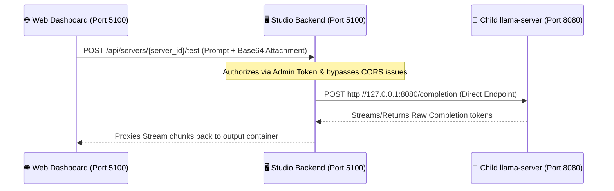

# Quick Test Feature Design & Architecture

The **Quick Test Console** provides a simple sanity-checking interface within the Llama Server Studio UI. It allows administrators to quickly verify if a running model server is responding correctly to text and multimodal inputs (images or audio clips) without needing to configure a complete OpenAI client or request route.

---

## 🛠️ Quick Test vs. 🔀 Gateway Server

| Feature | ⚡ Quick Test Console | 🔀 Gateway Server |
| :--- | :--- | :--- |
| **Purpose** | Simple sanity test & instance verification. | Production routing, load-balancing, and scaling. |
| **Endpoint** | `/api/servers/{server_id}/test` | `/v1/chat/completions` or `/v1/completions` |
| **Authentication** | Studio Admin Token (JWT/Cookie/Bearer) | API Key or public/private route tokens. |
| **Protocol** | Simple custom payload mapping (Prompt + 1 File). | Strict, full OpenAI-compatible API protocol. |
| **Target Routing** | Directed directly to one specific child `llama-server` process. | Dynamically routed to default or specific model profiles. |

---

## 🔄 Request Flow

Unlike the Gateway proxy, the **Quick Test** does not run on a separate port or bypass the Studio security layers:

### 1. The Client (Web UI)
* User attaches **one** optional file (an image or a voice/audio clip).
* The dashboard converts the attached file to a standard Base64 string.
* The frontend initiates an authenticated HTTP call to the main Studio Backend proxy route.

### 2. The Studio Backend
* Verifies the administrator's authentication session (checking the JWT/Bearer token).
* Restricts resource access and controls CORS policy safely under the central admin dashboard domain.
* Reconstructs the raw request body containing the custom prompt and optional base64-encoded `image_data` payload.
* Delegates the inference query securely to the underlying child `llama-server` instance.

### 3. Child llama-server
* The target instance handles the inference natively and streams the tokens back.
* The Studio Backend proxies these events in real-time back to the Web UI console output container.
